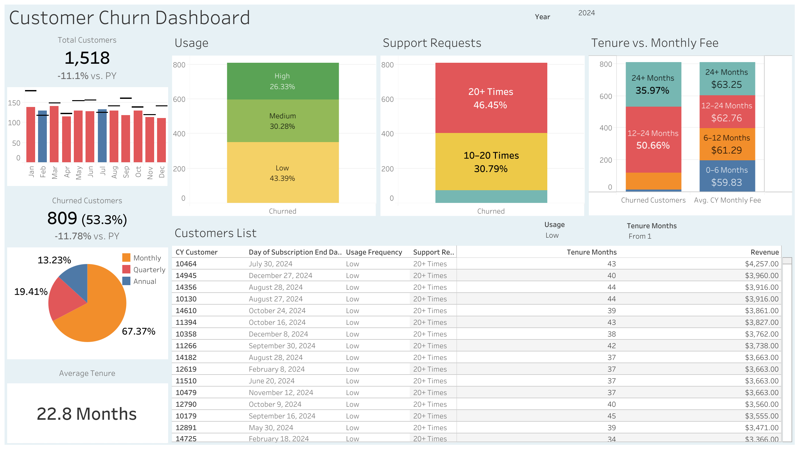

# Customer Churn Analysis

## Project Overview

This project analyzes customer subscription behavior to identify churn patterns, risk factors, and retention opportunities. Using SQL and Tableau, the analysis simulates real-world customer lifecycle monitoring and supports data-driven decision-making for customer retention strategies.

<https://public.tableau.com/app/profile/shu.richardson/viz/CustomerChurnAnalysis_17769718823230/CustomerChurnDashboard>

## Business Problem

Customer churn directly impacts revenue, customer lifetime value, and operational planning. Organizations need to understand:

- Which customers are most likely to churn
- What behaviors indicate churn risk
- How churn trends change over time
- Where retention efforts should be focused

The primary objectives of this analysis are to:

- Measure overall churn performance
- Identify drivers of customer churn
- Segment customers by risk level
- Monitor churn trends over time
- Support data-driven retention strategies

## Demonstrated Skills

- **Technical Skills:**  
SQL querying, Aggregations and calculations, Data segmentation, KPI development, Data modeling, Dashboard design, Business intelligence reporting  

- **Analytical Skills:**  
Customer retention analysis, Risk identification, Performance monitoring, Trend analysis, Business insight generation  

- **Business Skills:**  
Translating data into actionable insights, Supporting operational decision-making, Identifying performance drivers, Communicating results through dashboards  

## Business Insights

- Month-to-month customers have the highest churn rates  
- Customers with low usage frequency represent a significant retention risk  
- Customers with high support ticket volume have increased churn risk  
- Early-tenure customers are more likely to leave  
- Churn trends can be monitored monthly to detect performance changes  

## Next Steps

- Improve reporting accuracy by extending the existing Year parameter to support Month- and Day-level granularity for more detailed trend analysis
- Predictive churn modeling  
- Customer lifetime value forecasting  
- Retention intervention analysis  
- Cohort analysis  
- Customer segmentation modeling  
