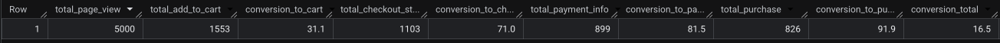
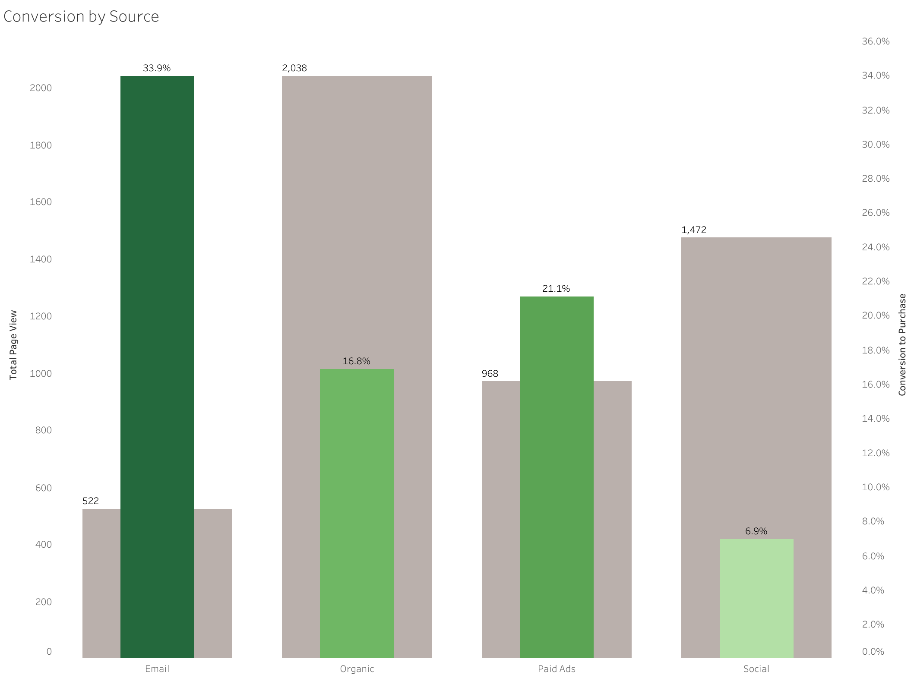
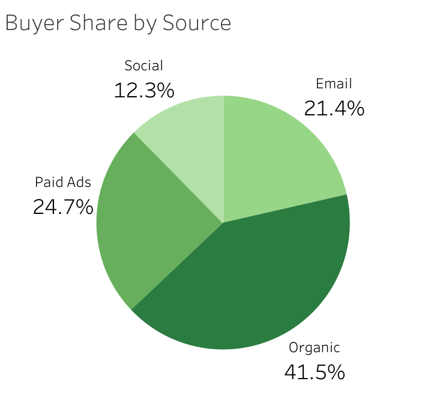
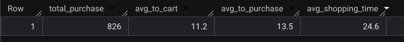
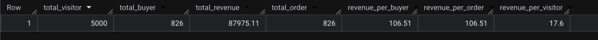

# E-Commerce Conversion Funnel Analysis (SQL)

## Executive Summary

This analysis examined 9,381 clickstream events from 5,000 users to diagnose why conversion remained flat despite increased marketing spend. Using SQL, I quantified drop-off at each funnel stage, benchmarked acquisition channels, measured time-to-purchase, and calculated revenue-per-user economics.

*After identifying that **the loss happens before the cart** and that **the social media channel** is the bottleneck in converting traffic to revenue, I recommend that the marketing team implement the following adjustments to drive higher conversion.*

### Recommendations

1. **Redirect optimization effort to the top of the funnel:** Nearly 70% of visitors leave without adding to cart, while users who reach checkout complete at over 90%. Product-page merchandising, pricing clarity, and social proof will move revenue more than further checkout UX work.
2. **Invest more in email marketing:** Email is the smallest channel (10.4% of traffic) yet converts at 33.9% — roughly 5x better than social and double the site average. Growing the email list through on-site capture and lead generation campaigns is the highest-ROI expansion available: the channel is proven, and scale is its only constraint.
3. **Audit social spend:** Social brings in nearly a third of all traffic but converts at just 6.9% — meaning the company pays for a lot of social visitors who never buy, making it the most expensive channel per customer acquired. Reallocate budget until social performance improves, or fix the targeting and landing-page mismatch driving the gap.
4. **Use $17.60 revenue per visitor as the CAC ceiling:** At 16.5% conversion and $106.51 per order, any channel costing more than $17.60 per visitor is unprofitable. This gives the paid media team a concrete bid-cap framework.

## Business Questions

The marketing team at an e-commerce retailer expanded its advertising budget heading into the holiday season, expecting a proportional lift in sales. Instead, the marketing manager noticed that while site traffic grew, purchases did not keep pace — conversion appeared to be declining, and it was unclear whether the problem was the website experience, the quality of the new traffic, or both. Attribution debates between the paid media and CRM teams stalled without shared numbers.

I was asked to bring data to the discussion by answering four questions:

1. **Where exactly do users drop off?** – Is the friction at product discovery, cart, or checkout?
2. **Is the new traffic actually converting?** – How do acquisition channels compare on purchase rate, not just volume?
3. **How long do users deliberate?** – Does the purchase happen in one session or over days — and what does that imply for retargeting?
4. **What is a visitor worth?** – What revenue-per-visitor ceiling should govern acquisition spend?

## Methodology

The analysis was written in BigQuery Standard SQL against a single event table. Selected findings were visualized in Tableau to present the results and insights effectively.

### Skills demonstrated

- **Funnel analysis with conditional aggregation** — pivoting a long event log into stage-level user counts using `COUNT(DISTINCT CASE WHEN ... END)`
- **CTE-based query design** — separating aggregation logic from ratio calculations for readability and maintainability
- **Cohort/segment analysis** — decomposing a blended conversion rate by acquisition channel to expose mix effects
- **User-journey reconstruction** — deriving first-touch timestamps per user per stage and measuring elapsed time with `TIMESTAMP_DIFF`
- **Filtering aggregated results** — using `HAVING` to isolate converted users for time-to-purchase analysis
- **Unit-economics metric design** — translating raw events into decision-ready KPIs (revenue per visitor, per buyer, per order)

## Key Findings

**1. The funnel leaks hardest at the top:** Of 5,000 visitors, only 31.1% added an item to cart. From there, the funnel is healthy: 71.0% of cart users started checkout, 81.5% of those entered payment info, and 91.9% of those completed the purchase. Overall conversion landed at 16.5%. The story is clear — this is a product-page problem, not a checkout problem.

**2. Channel quality varies five-fold:** Email was the smallest channel (10.4% of traffic) but converted at 33.9% — the best in the mix. Paid ads followed at 21.1%. Organic, the largest channel at 40.8% of traffic, converted at 16.8%, roughly the site average. Social was the outlier: it drove 29.4% of all traffic but converted at only 6.9%. Social accounted for just 12.3% of all buyers, meaning it supplied nearly a third of visitors while producing about one in eight buyers. The expanded ad spend wasn't wasted — but the social portion of it likely was.

**3. The purchasing process is smooth:** Among buyers, the average journey took 24.6 minutes end to end: 11.2 minutes from first page view to add-to-cart, and 13.5 minutes from cart to purchase. No stage of the journey takes more than an hour on average, so keeping the flow streamlined matters more than making changes that could disrupt the current frictionless experience.

**4. Solid unit economics with a clear spend ceiling:** The 826 buyers generated $87,975 in revenue, averaging $106.51 per order. Spread across all 5,000 visitors, that works out to $17.60 in revenue per visitor — the practical ceiling for what the business can afford to spend acquiring each visitor. Any channel or campaign costing more than that per visitor is losing money.

## Next Steps

- **A/B test product-page changes** (pricing display, reviews, imagery) targeting the view-to-cart rate — a 5-point improvement there adds more buyers than perfecting an already-strong checkout.
- **Deep-dive into social traffic quality:** segment by campaign and creative to determine whether low conversion is a targeting problem or a landing-page mismatch.
- **Analyze repeat-purchase behavior** over a longer time window to understand customer lifetime value beyond the first order.
- **Extend the analysis** with product-level conversion (which `product_id`s stall in the funnel) and day-of-week/time-of-day patterns to inform campaign scheduling.
- **Productionize the queries** as scheduled views feeding a Tableau/Looker funnel dashboard so the marketing team can monitor these metrics weekly instead of ad hoc.
