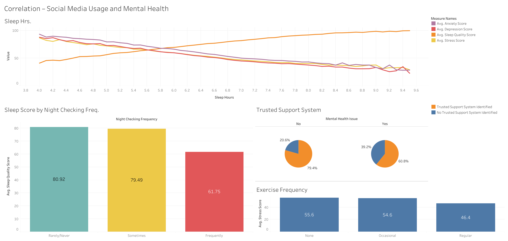

# Healthcare: Social Media Depression Exploratory Data Analysis

## Executive Summary

This portfolio project explores the relationship between social media behavior, lifestyle habits, and mental health outcomes through exploratory data analysis (EDA) technique.

### Live Dashboard

<https://public.tableau.com/app/profile/shu.richardson/viz/mentalhealth_17821885223430/Dashboard1>

1. Insufficient sleep is associated with reduced sleep quality scores, as well as elevated anxiety, depression, and stress scores.
1. Poor sleep quality is correlated with the frequency of nighttime social media checking.
1. Regular exercise is associated with significantly lower stress score levels.
1. Individuals experiencing mental health challenges are less likely to have a trusted person they feel comfortable speaking with about personal concerns.

Based on these findings, the following recommendations are proposed to help reduce the risk of mental health challenges among users:

1. Implement digital wellness education initiatives focused on screen time management, reducing nighttime device usage, and introducing restricted-content or “safe mode” features.
1. Develop partnerships with fitness centers, wellness platforms, and community health organizations to encourage healthier lifestyle habits and improve access to wellness resources.
1. Establish mentorship or peer-support programs that provide safe, trusted spaces for individuals to discuss personal concerns, stress, and mental health challenges.

## Business Problem

Healthcare organizations and wellness platforms are facing an increasing number of patients with mental health issues and are interested in identifying behavioral indicators associated with anxiety, stress, sleep disruption, and depressive symptoms. How can social media usage patterns help identify higher-risk populations and behavioral trends associated with declining mental wellness?

## Demonstrated Skills

- **SQL:**  
CTEs, joins, View, CASE statements, aggregate functions, and exploratory data analysis (EDA)

- **Tableau**  
Data Visualization, Dashboard Design, Stakeholder Reporting

## Key Insights & Recommendations

1. Total screen time and notification frequency showed limited direct correlation with mental health outcomes; however, users who frequently checked social media late at night or before sleep were approximately 30% more likely to report anxiety, depression, or stress-related symptoms than users who primarily engaged during daytime hours.
1. Sleep disruption demonstrated a stronger association with anxiety and stress indicators than total daily screen time, suggesting sleep quality may be a more significant behavioral risk factor than overall usage duration.
1. Individuals who exercised regularly — including 20–30 minutes daily or several hours weekly — reported significantly lower rates of anxiety, depression, and stress-related symptoms compared to less active individuals.
1. Individuals reporting mental health concerns slept an average of 1.5 fewer hours per night compared to individuals without reported symptoms.
1. More than 70% of individuals reporting mental health concerns indicated prior exposure to cyberbullying or online harassment.
1. Compared to individuals without reported mental health concerns, significantly more users experiencing anxiety, depression, or stress reported lacking a trusted support system or someone they could openly talk to about personal concerns.

## Next Steps

1. A/B testing to improve engagement effectiveness
1. User education on digital wellness and stress management
1. Monitor program engagement and participation rates
