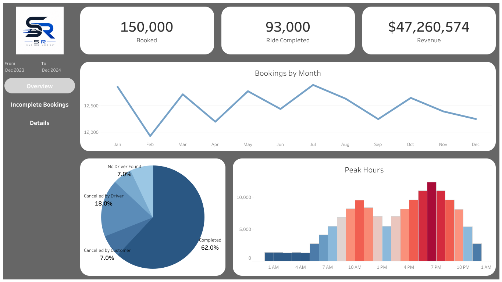
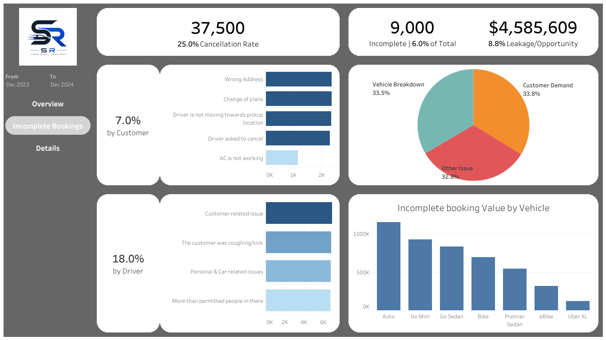
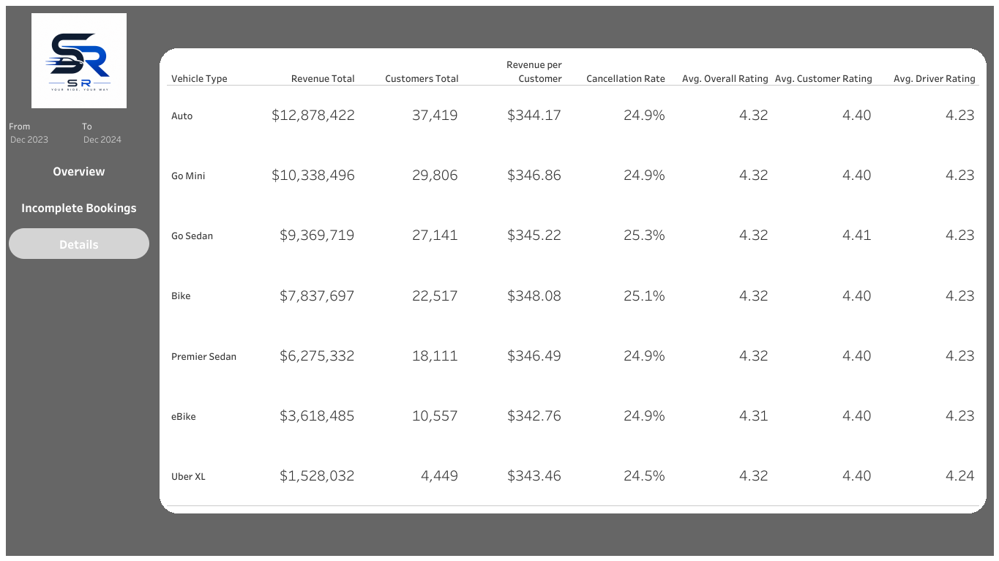

# Ride Revenue Analysis

## Executive Summary

Transportation platforms must continuously monitor:

1. Revenue performance
1. Booking success rates
1. Operational failures (cancellations, incomplete rides)
1. Customer experience

Without clear visibility, businesses risk revenue loss, poor service quality, and reduced customer retention.

This project analyzes ride booking data to evaluate revenue performance, service reliability, and operational efficiency. Using SQL and Tableau, the analysis simulates real-world business monitoring for a transportation platform. The goal is to identify revenue drivers, understand booking outcomes, and uncover operational issues that impact customer experience and business performance.

### Demonstrated Skills

- KPI development and performance tracking  
- Revenue and trend analysis  
- Operational performance monitoring  
- Root cause analysis (cancellations & failures)  
- Data visualization and dashboard design  

**Live Dashboard:**  
<https://public.tableau.com/app/profile/shu.richardson/viz/RideRevenueAnalysis/Overview>

### Incomplete & Cancellation Analysis

- Total cancellations and cancellation rate
- Customer vs. driver cancellations and reasons
- Incomplete ride rate and reasons

Identifies operational inefficiencies and root causes of failed bookings.

### Vehicle-Level Performance (Detailed Table)

Metrics analyzed by vehicle type:

- Total customers  
- Average customer rating  
- Average driver rating  
- Average ride distance  
- Total revenue  
- Revenue per customer  

Highlights high-performing and underperforming service segments.

### Key Insights

- Certain vehicle types contribute disproportionately to total revenue  
- Cancellations and incomplete rides significantly impact operational efficiency  
- Customer and driver ratings vary across service types  
- Revenue trends fluctuate based on demand and booking volume  

### Next Steps

- Revenue forecasting (time-series analysis)  
- Peak demand and surge analysis  
- Geographic performance analysis (pickup/drop hotspots)  
- Customer segmentation (high-value vs. low-value users)  
- Improve reporting accuracy by extending time granularity (Month/Day-level analysis)  
