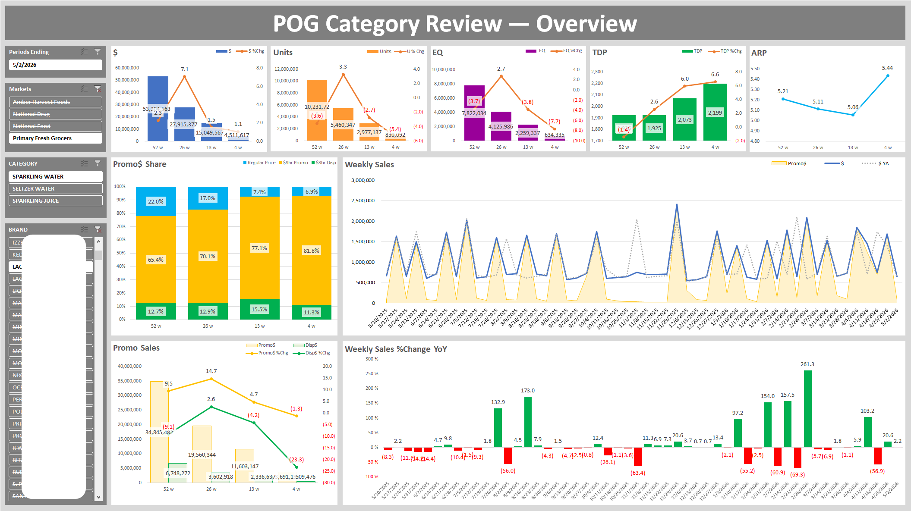
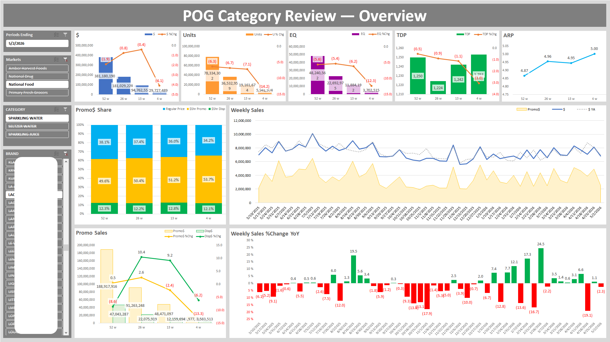
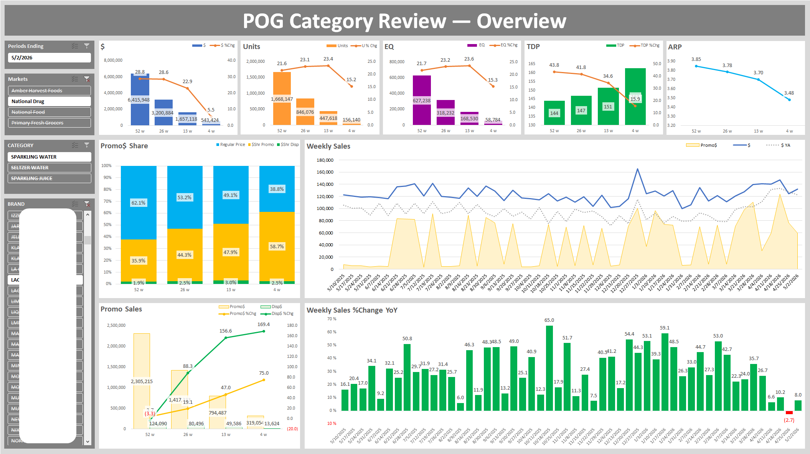

# Sales Marketing: Performance Score for CPG Beverage Companies

## Summary

This project showcases marketing insights and strategic recommendations for the CPG beverage industry using real-world syndicated datasets and interactive Excel dashboards to evaluate sales performance across retail channels and store-level markets.

## Methodology

1. Data Collection: Extracted sales and performance metrics for targeted retail markets and channels from syndicated databases.
1. ETL Using Power Query: Consolidated syndicated datasets and internal warehouse data across multiple formats — including databases, CSV files, and Excel dictionary files — for data cleaning, transformation, and customized reporting.
1. Insights & Recommendations: Built interactive Excel dashboards to monitor market performance, identify growth opportunities, and support strategic business decisions.

## Demonstrated Skills

**Syndicated Datasets:**  
Market Selection, KPI Development, Clustering, Aggregation, Reusable Reporting Extracts

**Power Query:**  
Data Validation, Null/Outlier Handling, Normalization, Transformation, Deduplication, Joins, Data Splitting

**Excel & Dashboarding:**  
Pivot Tables, Calculated Fields, Data Visualization, Filters, Slicers, KPI Tracking, Benchmarking, Dashboard Design, Stakeholder Reporting

**Business Analysis:**  
Sales Performance Analysis, Promotional Effectiveness Analysis, Seasonal Trend Analysis, Pricing Analysis

**Other Skills:**  
Problem Framing, Requirements Gathering, Scoring Methodologies, Reusable Dashboard Development, Strategic Recommendations, Stakeholder Collaboration

## Case 1: Retail – Primary Fresh Grocers

### Business Problem

The brand expanded promotional investments and distribution within the Primary Fresh Grocers channel to support growth. However, despite positive distribution trends, sales growth weakened during the latest quarter as unit performance deteriorated and promotional dependency increased. This analysis evaluated promotional effectiveness, display support, pricing trends, and distribution performance to identify opportunities to improve sustainable revenue and volume growth.

### Executive Summary

1. Sales growth at Primary Fresh Grocers weakened during the latest quarter despite continued distribution expansion and increased promotional intensity.
1. Declining display support contributed to lower unit volume and limited sustainable sales growth, while revenue performance became increasingly dependent on promotional activity and distribution gains.
1. Over 80% of promotional dollars were concentrated within promotional periods during the latest 4 weeks, indicating growing consumer reliance on discount-driven purchasing behavior.
1. The absence of seasonal Halloween promotional support contributed to an approximate $2M decline in weekly sales during the comparable period.

Based on these findings, the following strategic recommendations were identified to improve baseline sales growth and promotional efficiency.

### Recommendations

1. Execute major seasonal promotions consistently, including Halloween campaigns that historically delivered approximately $2M in weekly sales, to prevent seasonal sales declines and stabilize promotional performance.
1. Reset and lower the everyday price to reduce overreliance on promotion-driven sales by improving non-promotional purchase behavior
1. Increase display activity to improve in-store visibility and support baseline sales growth

### Key Insights

1. Unit volume declined by -7.0% while dollar sales growth remained relatively flat, indicating pricing and distribution gains partially offset weakening consumer demand
1. Promotional and display sales declined during the latest 26-week period, but expanding distribution helped offset sales losses
1. Distribution expanded significantly from 1,786 to 2,199 TDP, providing strong support for market reach and sales stabilization
1. The absence of seasonal Halloween promotional support, which historically generated approximately $2M in weekly sales, contributed to a significant -63.4% weekly sales decline during the comparable period.
1. Dollar sales growth turned flat during the latest 4 weeks as display support significanly declined despite continued positive trends in distribution growth
1. Promotional share exceeded 80% during the latest 4-week period, representing a significant increase versus 52 weeks and indicating growing consumer dependence on promotional pricing

## Case 2: Channel – National Food

### Business Problem

The brand increased promotional investments within the National Food channel to accelerate growth. However, sales performance continued to weaken despite higher promotional activity. This analysis assessed promotional effectiveness, distribution performance, and consumer demand trends to identify opportunities to improve revenue growth and sales efficiency.

### Executive Summary

Sales and unit declines accelerated in the National Food channel despite increased promotional activity during the latest quarter, indicating diminishing promotional effectiveness and weakening consumer demand. Additional findings revealed persistent distribution declines and limited sustained baseline sales growth.

### Recommendations

1. Prioritize distribution recovery to stabilize market reach and improve baseline sales volume
1. Reduce low-efficiency promotional frequency and reallocate investment toward higher-performing promotional periods
1. Expand multipack and value-focused product strategies to strengthen consumer demand and purchase volume

### Key Insights

1. Dollar sales declined across all major periods, with the steepest decline occurring during the latest 4 weeks (-4.1%)
1. Unit and EQ declines significantly outpaced dollar sales declines while ARP increased from $4.87 to $5.00, suggesting growing consumer price sensitivity and weakening purchase volume
1. Promotional share increased from 49.6% to 53.7%, while promotional sales growth deteriorated sharply, indicating diminishing promotional effectiveness and lower incremental returns
1. Weekly sales trends showed heavy dependence on short-term promotional spikes with limited sustained baseline sales growth
1. Consumers showed stronger purchasing behavior toward larger multipack products, indicating higher perceived value and stronger unit-per-cost economics

## Case 3: Channel – National Drug

### Business Problem

The brand increased promotional and distribution investments to accelerate growth within the National Drug channel. However, sales growth slowed despite more aggressive promotional activity. The objective of this analysis was to identify inefficiencies in promotional strategy, evaluate pricing effectiveness, and uncover opportunities to improve revenue growth and promotional performance.

### Executive Summary

Sales growth in the National Drug channel slowed during the latest quarter despite continued unit and distribution growth. Dashboard analysis revealed that increasingly aggressive promotional activity and declining Average Retail Price (ARP) reduced revenue efficiency and limited incremental sales gains. Additional findings also identified missed seasonal promotional opportunities and overreliance on short-term promotional spikes.

### Recommendations

1. Avoid deep promotional discounting that drives ARP below the historical mid-$3.70 range, where incremental unit gains no longer offset declining revenue efficiency
1. Add promotional support during Memorial Day week to capture incremental seasonal demand
1. Increase promotional dollar contribution closer to total dollar share to improve promotional effectiveness and sales conversion efficiency
1. Expand focus on larger multipack products, which demonstrated stronger consumer purchase behavior and value perception

### Key Insights

1. Distribution growth (+43.8%) significantly outpaced dollar sales growth (+28.8%), indicating weaker revenue conversion efficiency
1. ARP declined from $3.85 to $3.48 as promotional activity intensified, contributing to slower dollar sales growth despite positive unit growth
1. Promotional intensity increased during the 13 and 4 week periods, but incremental unit gains failed to offset declining revenue per unit, indicating diminishing promotional returns
1. Memorial Day lacked promotional support, while Fourth of July promotions underperformed relative to several non-holiday promotional periods
